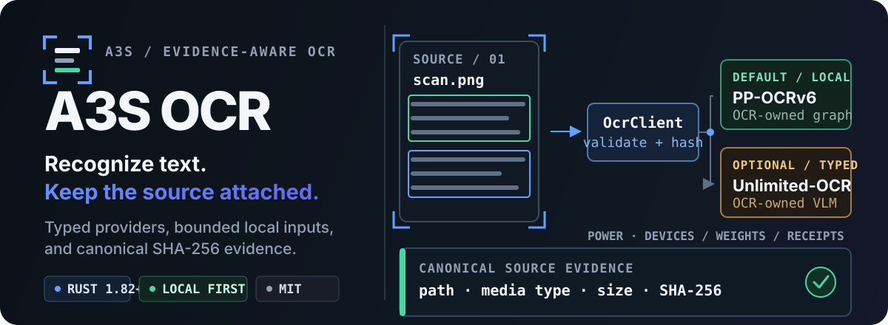

  

  <strong>Provider-oriented OCR for Rust and A3S, with source provenance kept in the result.</strong>

  
  
  
  
  
  

  <a href="#quick-start">Quick start</a> ·
  <a href="#the-contract-ocr-plus-provenance">Contract</a> ·
  <a href="#providers">Providers</a> ·
  <a href="#cli-and-mcp-surfaces">CLI &amp; MCP</a> ·
  <a href="#development">Development</a>

---

`a3s-use-ocr` is the independently maintained OCR library behind the built-in
A3S Use OCR route. Its stable boundary is [`OcrProvider`](#the-provider-interface),
not a single model.

Every extraction starts with the same client-owned work: resolve a bounded
local image, verify its media type, read it once, and compute canonical source
evidence. Only then are the bytes passed to an injected provider. A provider
must declare its source-transfer policy and cannot replace the source path,
media type, size, or SHA-256 recorded by `OcrClient`. Both built-in providers
reuse A3S Power's embedded, model-neutral inference substrate; neither enables
Power's HTTP server or opens its own listener.

## Quick start

With A3S Use installed, inspect the configured provider before reading an
image:

~~~bash
a3s use ocr doctor --json
~~~

The diagnostic reports the provider, engine, model, readiness, and
`sendsSourceOffDevice` policy. For the default local provider, install the pinned
model bundle if the diagnostic suggests it, then extract:

~~~bash
a3s install use/ocr
a3s use ocr extract ./scan.png --json
~~~

The standalone binary exposes the same domain operations:

~~~bash
a3s-use-ocr doctor --json
a3s-use-ocr extract ./scan.png --json
a3s-use-ocr serve --mcp
~~~

### Embed the client in Rust

The default feature set includes PP-OCRv6, MCP, and the CLI:

~~~bash
cargo add a3s-use-ocr
~~~

~~~rust
use a3s_use_ocr::{OcrClient, OcrRequest, UseResult};

async fn extract(path: impl Into<std::path::PathBuf>) -> UseResult<String> {
    let client = OcrClient::from_env()?;
    let result = client.extract(OcrRequest { path: path.into() }).await?;
    Ok(result.text)
}
~~~

Use `default-features = false` when an application only needs the neutral
contract and client.

## The contract: OCR plus provenance

The provider owns recognition. `OcrClient` owns the evidence envelope.

| Owned by `OcrClient` | Owned by the provider |
| --- | --- |
| Canonical path, detected media type, byte size, SHA-256 | Recognition text and model identity |
| Input bounds and supported image signatures | Optional confidence, category, polygons, and bounding boxes |
| Provider-output validation | Readiness messages and provider-specific warnings |
| Final `OcrResult` assembly | Declared off-device source policy |

Native results may also contain `executionReceipts`. Each receipt binds a
model family and revision, the exact weight digest, Power runtime/device
identity, and canonical input/output digests. Downstream parsers should
preserve these receipts with the OCR evidence.

The stable result shape keeps the source next to the OCR evidence:

~~~jsonc
{
  "provider": "unlimited-ocr",
  "engine": "a3s-power-native",
  "model": "baidu/Unlimited-OCR",
  "source": {
    "path": "/canonical/path/to/scan.png",
    "mediaType": "image/png",
    "size": 12345,
    "sha256": "..."
  },
  "text": "...",
  "blocks": [
    {
      "page": 1,
      "text": "...",
      "category": {"rawLabel": "title", "role": "title"},
      "boundingBox": {"x": 12, "y": 24, "width": 208, "height": 74},
      "boundingBoxes": [
        {"x": 12, "y": 24, "width": 208, "height": 34},
        {"x": 12, "y": 64, "width": 180, "height": 34}
      ]
    }
  ],
  "executionReceipts": [
    {
      "schema": "a3s.power.embedded-execution-receipt.v1",
      "model": {"family": "baidu/Unlimited-OCR", "revision": "07dea832...", "weightsSha256": "..."},
      "runtime": {"name": "a3s-power-native", "version": "0.6.0", "device": "metal:0"},
      "input": {"representation": "image-request", "sha256": "...", "byteLength": 12345, "itemCount": 1},
      "output": {"representation": "utf8-text", "sha256": "...", "byteLength": 321, "itemCount": 287}
    }
  ],
  "warnings": []
}
~~~

Category, confidence, and geometry are optional. `category.rawLabel` preserves
a bounded provider label without declaring the provider taxonomy closed;
`category.role` is a conservative provider-neutral interpretation. Component
boxes retain exact provider geometry, while `boundingBox` is their compatibility
envelope. OCR output is evidence derived from the source, not verified source
text.

## Providers

Provider choice is a typed object, never a raw backend-name switch.

| Provider | Runtime | Source boundary |
| --- | --- | --- |
| `PpOcrV6Provider` | Embedded A3S Power native graph runtime | Always on device |
| `UnlimitedOcrProvider` | Embedded A3S Power native VLM runtime | Always on device |
| Custom `OcrProvider` | Defined by the implementation | Required in its descriptor |

### Default: PP-OCRv6

The default A3S integration uses:

- provider ID: `pp-ocr-v6`
- engine: `a3s-power-native`
- pinned bundle: `PP-OCRv6_small`
- transfer policy: local only

Its pipeline is explicit:

~~~text
decode → detect → DB post-process → reading order → perspective crop
       → batched recognition → CTC decode → source-pixel evidence
~~~

The OCR-owned release packages pinned detection and recognition SafeTensors
plus their inference configuration. Installation verifies the archive length
and SHA-256, extracts only the four declared files, and records the exact Power
weight digests. Installation and repair remain explicit:

~~~bash
a3s install use/ocr
a3s install use/ocr --force
~~~

`A3S_OCR_MODEL_DIR` can point development builds at an explicit model bundle.
`A3S_USE_OCR_HOME` overrides the managed model root for packaging, tests, or an
isolated installation. The provider executes reviewed OCR-owned graph plans
through Power's shared admission, device, limit, integrity, cancellation, and
receipt mechanisms. It does not require ONNX Runtime, Python, PaddlePaddle, a
subprocess, an inference service, or a Web listener.

Linux CI installs that exact pinned bundle and executes both reviewed graphs on
the CPU. The gate checks the canonical Power weight digests, exact output
shapes, item counts, and byte lengths for the zero-tensor detection and
recognition fixtures. A repeated execution on the same runner must reproduce
the complete tensor and canonical output digest; a missing model cannot turn
the test into a pass.

See [Native Inference Architecture](docs/native-inference.md) for the Power/OCR
ownership boundary, model conversion and install integrity, execution receipts,
and TEE/privacy release gates.

### Optional: baidu/Unlimited-OCR

Enable the `unlimited-ocr` feature to run the reviewed 3B vision-language model
in-process. A3S OCR owns the native Rust model topology, tokenizer,
preprocessing, generation loop, revision pins, and grounding parser. A3S Power
supplies the shared device, admission, weight-integrity, residency, routing,
cancellation, telemetry, and receipt mechanisms.

~~~rust
use a3s_use_ocr::{
    OcrClient, ResidencyBudgetPolicy, UnlimitedOcrConfig,
    UnlimitedOcrProvider,
};

fn local_unlimited_ocr() -> Result<OcrClient, Box<dyn std::error::Error>> {
    let residency = ResidencyBudgetPolicy::new(5_000, 5_000)?
        .with_host_reserve_bytes(2 * 1024 * 1024 * 1024)
        .with_device_reserve_bytes(512 * 1024 * 1024);
    let config = UnlimitedOcrConfig::new("/models/baidu-unlimited-ocr")?
        .with_residency_budget_policy(residency)?
        .with_max_generated_tokens(8_192)?;
    OcrClient::with_provider(UnlimitedOcrProvider::new(config)?)
}
~~~

`UnlimitedOcrConfig::from_env` reads the same local path from
`A3S_UNLIMITED_OCR_MODEL_DIR`. Provider creation is lazy: it performs no model
download, process launch, network request, or socket bind. Session loading
accepts only the pinned upstream revision
`07dea832e22aefee32ad281d4b80551282e1c168`, verifies the exact tokenizer and
processor assets, and asks Power to perform the single full SafeTensors hash
and inventory verification path, including any explicitly configured verified
replicas. The reviewed primary weight file is exactly 6,672,547,120 bytes
with SHA-256
`2bc48a7a110061ea58fff65d3169367eebe3aee371ca6968dc2219c1b2855fc6`.

The native forward path follows the authoritative upstream implementation:

~~~text
EXIF-aware decode
  → 1024px global view + optional bounded 640px tile grid
  → SAM ViT-B detail tower
  → CLIP-L semantic tower over SAM patch features
  → 2048 → 1280 projector + spatial newline/view separator packing
  → 12-layer DeepSeek-style decoder (64 routed experts, exact top-6)
  → deterministic greedy decode + sliding no-repeat 35-gram
  → bounded Markdown and source-pixel grounding
~~~

One logical extraction holds one Power permit and cancellation token across
the complete vision, projector, decoder, and grounding flow. Routed experts
use Power's exact batch union and private-by-default route telemetry rather
than a second OCR-local cache. Cache residency remains zero by default. A typed,
opt-in `ResidencyBudgetPolicy` asks the selected Power runtime to discover
bounded host/CUDA/Metal capacity and derive the cache bytes from explicit
fractions, reserves, caps, and runtime limits; Metal unified memory is counted
once. Manual cache bytes and automatic budgeting are mutually exclusive.
Capacity snapshots are neither persisted nor added to telemetry or execution
receipts. With either explicit cache mode, bounded expert prefetch overlaps
shared-expert computation and uses Power's LFRU/LRU placement. Dropping the
awaiting recognition future cancels that shared token; the blocking native
worker then stops at its bounded preprocessing, vision, and decoder cancellation points.
The provider emits one final receipt binding the source image digest, reviewed
weight collection, Power device, and user-visible UTF-8 text.

CPU is available with `unlimited-ocr`. Build with `unlimited-ocr-metal` for an
explicit Apple Metal device or `unlimited-ocr-cuda` for an explicit NVIDIA CUDA
device. Typed device selection fails closed when the requested accelerator is
unavailable. Running inside Power's TEE deployment retains model integrity,
resource bounds, private telemetry, and receipt guarantees; source bytes and
detailed routing data are never exported by this provider.

The provider applies the upstream single-image prompt and no-repeat n-gram
policy in the native generation loop and preserves generated Markdown. It
strictly parses both grounding forms reviewed in the upstream model
implementation:

~~~text
<|ref|>title<|/ref|><|det|>[[x1, y1, x2, y2]]<|/det|>text
<|det|>text [x1, y1, x2, y2]<|/det|>text
~~~

Unlimited-OCR coordinates use the closed `0..=999` basis documented by the
[upstream postprocessor](https://huggingface.co/baidu/Unlimited-OCR/blob/07dea832e22aefee32ad281d4b80551282e1c168/modeling_unlimitedocr.py#L62-L111).
A3S OCR resolves the verified input dimensions and maps valid non-image
grounding into typed source-pixel `OcrBlock` evidence. Every valid component
box is preserved in model order and `boundingBox` remains the bounded union for
compatibility. The bounded raw label is retained next to a conservative role:
explicit titles, headings, paragraphs, tables, captions, equations, running
headers/footers, footnotes, page numbers, and code receive matching roles;
other valid labels remain `unknown` rather than being promoted. The upstream
taxonomy is intentionally treated as open.

The implementation evaluates no model text as code, fabricates no confidence, and
emits no geometry for missing, malformed, out-of-range, empty, image-only, or
EXIF-transformed grounding. It never trusts generated image paths. This follows
the upstream loader's EXIF-transpose behavior without mislabeling transformed
coordinates as untransformed source pixels. Degraded grounding remains visible
through one bounded warning while the generated text is preserved. Diagnostics
validate the local asset manifest without doing the 6.7 GiB hash twice; the
first session open completes Power's mandatory full checkpoint verification.

### The provider interface

`OcrProvider` stays object-safe, `Send + Sync`, and independent of concrete
provider dependencies:

~~~rust
#[async_trait::async_trait]
pub trait OcrProvider: Send + Sync {
    fn descriptor(&self) -> OcrProviderDescriptor;
    fn diagnostic(&self) -> OcrProviderStatus;
    async fn recognize(&self, input: OcrInput) -> UseResult<OcrProviderOutput>;
}
~~~

Inject an implementation with `OcrClient::with_provider(provider)` or
`OcrClient::from_provider(Arc<dyn OcrProvider>)`. The descriptor must include a
stable provider ID, engine name, and off-device source policy.

## CLI and MCP surfaces

| Surface | Entry point | Provider behavior |
| --- | --- | --- |
| A3S Use | `a3s use ocr ...` | Reserved built-in route; PP-OCRv6 is the current default |
| Standalone CLI | `a3s-use-ocr ...` | Equivalent `doctor`, `extract`, and `serve --mcp` operations |
| Rust library | `OcrClient` | Accepts any typed provider |
| Standard MCP | `OcrMcpServer::new(client)` | Exposes `ocr_doctor` and `ocr_extract` |

`OcrMcpServer` projects the provider's source-transfer policy into the
`ocr_extract` tool annotation. A custom off-device provider therefore remains
visible to the MCP host instead of looking like a local-only read.

## Feature flags

| Feature | Adds |
| --- | --- |
| `power-runtime` | Model-neutral embedded A3S Power runtime; never enables its server feature |
| `ppocr-v6` | Local PP-OCRv6 provider, native graph plans, installer, image pipeline |
| `unlimited-ocr` | Native CPU Unlimited-OCR model, tokenizer, image pipeline, generation, and grounding |
| `unlimited-ocr-metal` | Unlimited-OCR plus the Power/Candle Apple Metal device path |
| `unlimited-ocr-cuda` | Unlimited-OCR plus the Power/Candle NVIDIA CUDA device path |
| `mcp` | Provider-neutral standard MCP host |
| `cli` | Standalone CLI; assembles PP-OCRv6 and MCP |
| default | `ppocr-v6`, `mcp`, and `cli` |

## Input and trust boundaries

- Inputs are regular local files between 1 byte and 32 MiB.
- Supported signatures are PNG, JPEG, WebP, GIF, BMP, and TIFF.
- URLs and PDF rasterization are outside the current client contract.
- Providers cannot replace the canonical source evidence created by
  `OcrClient`.
- Pages start at 1; returned confidence values must be finite and between 0 and
  1.
- Provider labels and component-box lists are bounded; a component list must
  exactly agree with its compatibility envelope.
- Both built-in providers never transfer source bytes off device.
- Unlimited-OCR source boxes and categories are emitted only from valid,
  bounded `0..=999` grounding and decoded source-image dimensions; malformed
  markers never become boxes or semantic claims.
- Model installation, repair, and checkpoint acquisition are never hidden
  inside extraction.
- The built-in embedded inference boundaries contain no ONNX Runtime, external
  OCR service, HTTP client/server, browser automation, Python runtime,
  subprocess inference, or network listener.

## Development

Run checks from this crate repository, not from the A3S monorepo root:

~~~bash
cargo fmt --all -- --check
cargo test --no-default-features --lib --locked
cargo test --no-default-features --features unlimited-ocr --locked
cargo check --no-default-features --features mcp --locked
cargo test --features unlimited-ocr --locked
cargo clippy --all-targets --features unlimited-ocr --locked -- -D warnings
tools/check_official_ppocr_v6.sh /tmp/a3s-ppocr-v6-gate
# On macOS:
cargo check --no-default-features --features unlimited-ocr-metal --locked
cargo package --locked
~~~

The library depends on the released `a3s-use-core` machine contracts. A3S Use
pins an immutable OCR revision when assembling the built-in route, packaged
Skill, and model assets.

Release ownership

This repository owns the provider interface, default PP-OCRv6 implementation,
native Unlimited-OCR implementation, tests, model provenance, Skill content,
crate publication, and platform archives. A3S Use owns the built-in route, chosen
default provider, capability projection, component policy, and final product
assembly. Releases meet through immutable revisions and SHA-256-bound
artifacts.

## License

Licensed under the [MIT License](LICENSE). See
[Third-Party Notices](THIRD_PARTY_NOTICES.md) for model and runtime provenance.
